# Portfolio Website: T1A3

My netlify deployed site: https://chicky-portfolio-site.netlify.app/
My github link: https://github.com/Thomas-Piroddi/Portfolio-assignment

## 1) Purpose

The purpose of my portfolio site is to create a digital diary of myself. I made this portfolio with the intention of letting the reader get to know a little about me with a few simple clicks. The page shows my applied knowledge of both HTML and CSS that we have covered in class so far.

## 2) Functionality/features

The site is reasonably simple and easy to navigate. It contains 4 components including the home page. The style of the pages are very simplistic and easy top navigate, with a light coloured text standing out on a dark coloured background. Where applicable I used large text and tried to keep text blocks as relevant and concise as possible to keep the audiences attention. I’ve utilised both in-page comments and semantic HTML for easy de-bugging for myself and the convenience of anyone who reads over the code.

I’ve kept with the white/orange on purple theme throughout all of the pages for easy user-readability along with a consistent navigation bar so that you can always trace back to any of the pages. The site maintains responsive and appropriate design across desktop, tablet, and mobiles, utilising media query to ensure for a genuine user experience. The site also produced a perfect SRC rating. This functioned was utilised to make sure the accessibility and performance was up to scratch and the site could be available for all to use. This was also implemented to assure users that the resources they're fetching haven't been manipulated.

Implement Subresource Integrity (SRI) to enable browsers to verify that resources they fetch are delivered without unexpected manipulation.	

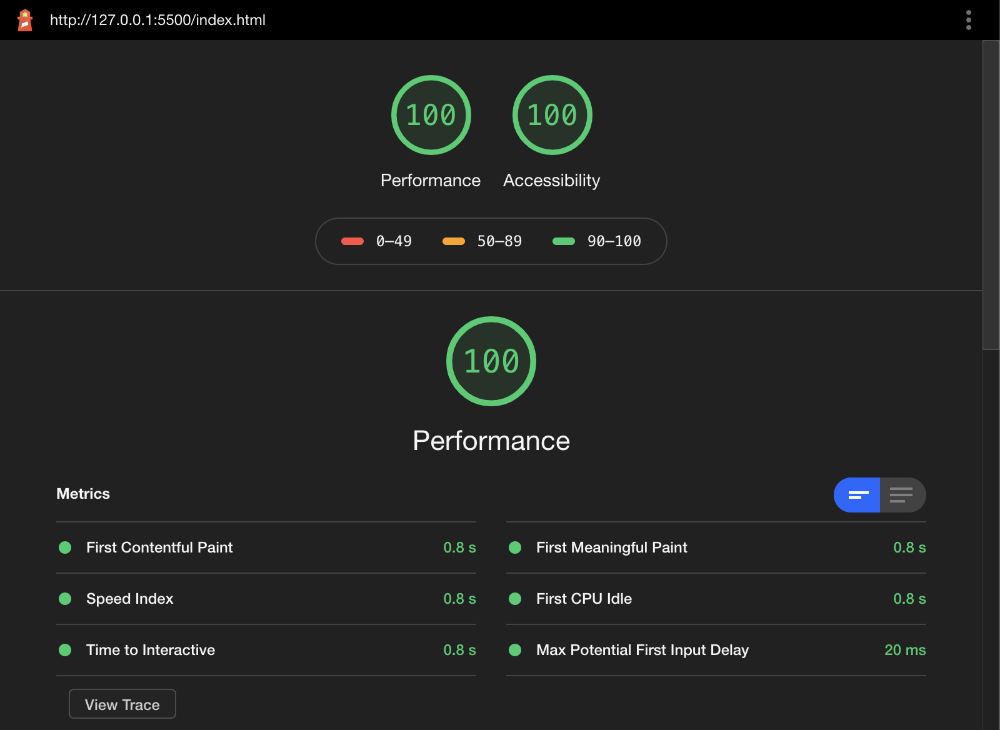

## 3) Sitemap
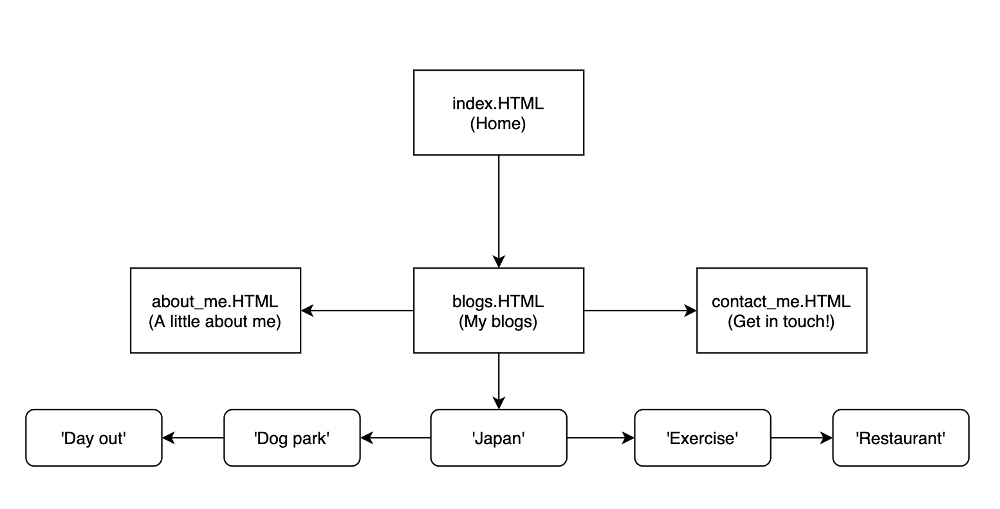

## 4) Screenshots & wireframes
I used Balsamiq to get my preferred framework for the site.
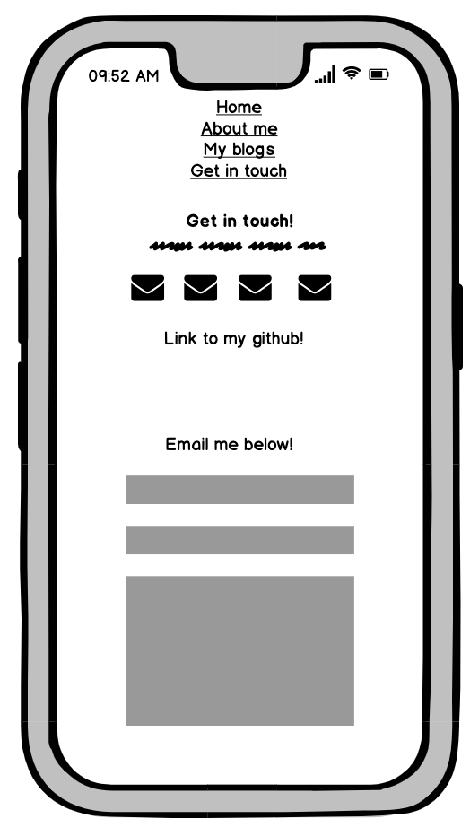
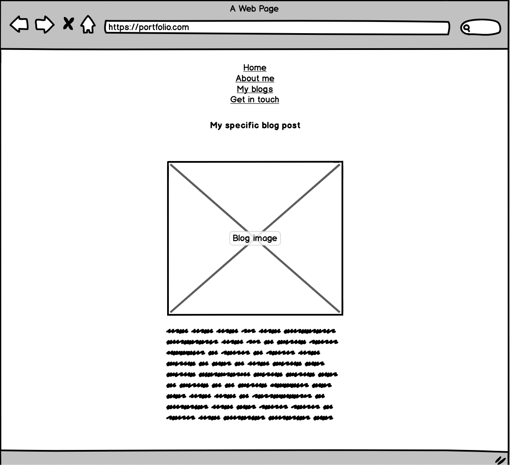
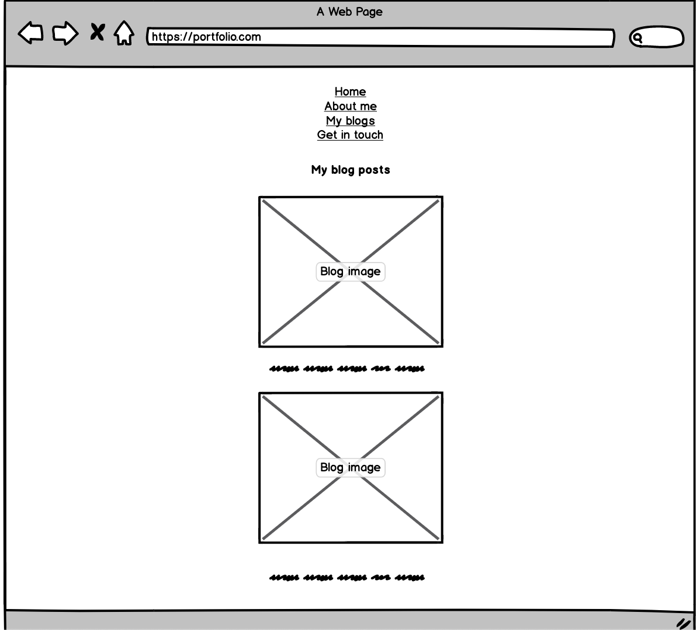
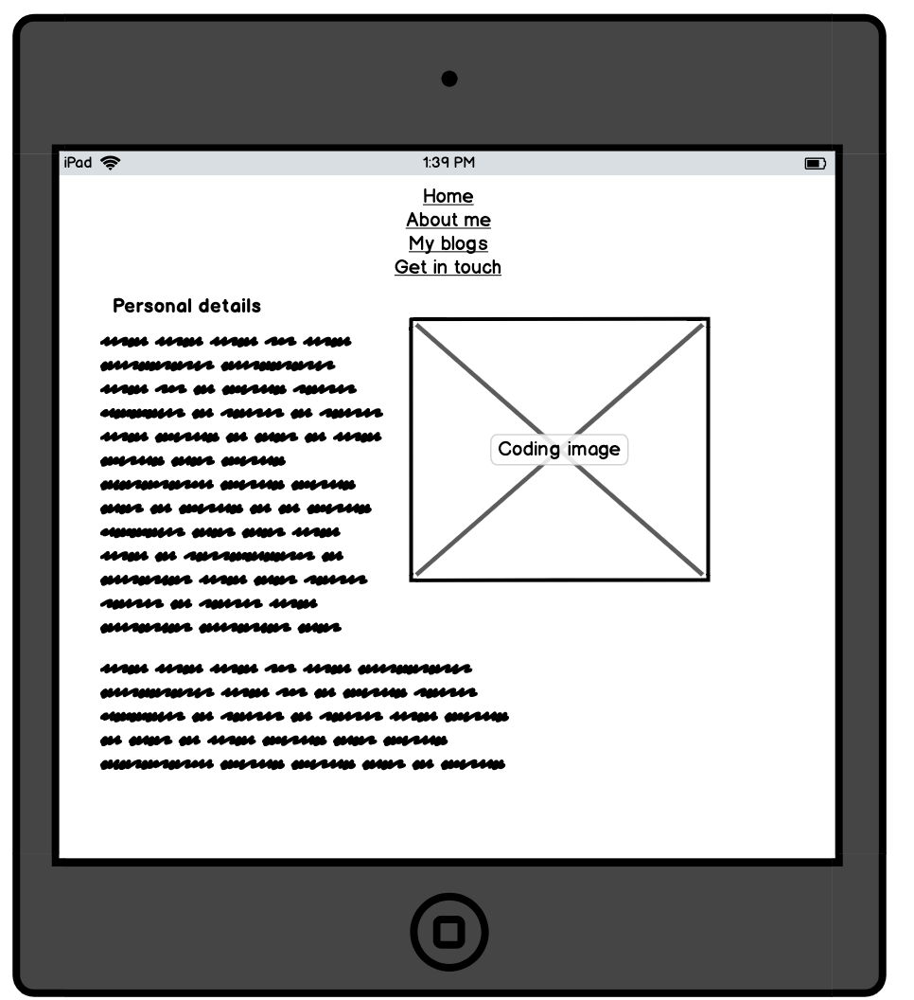
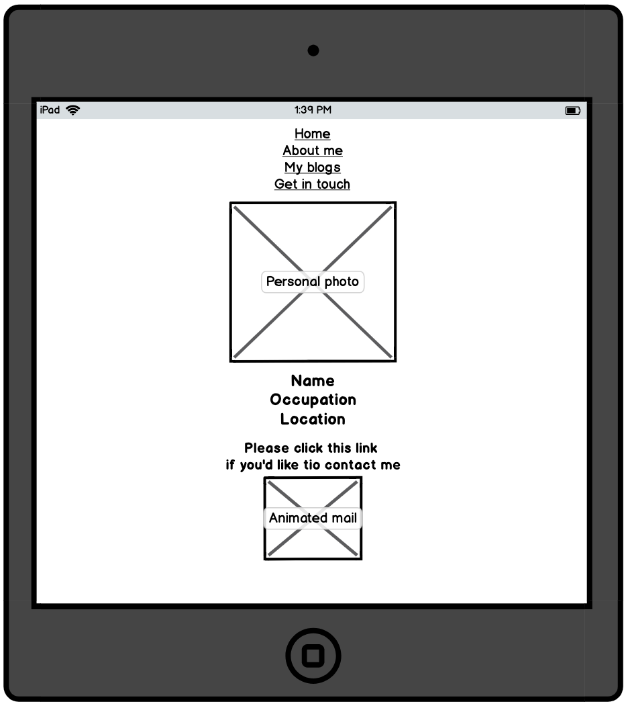
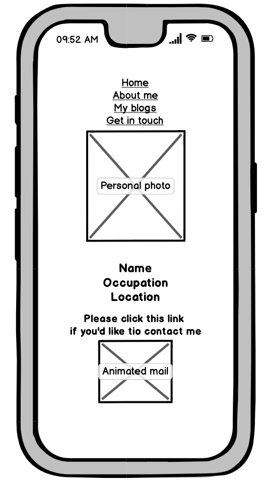
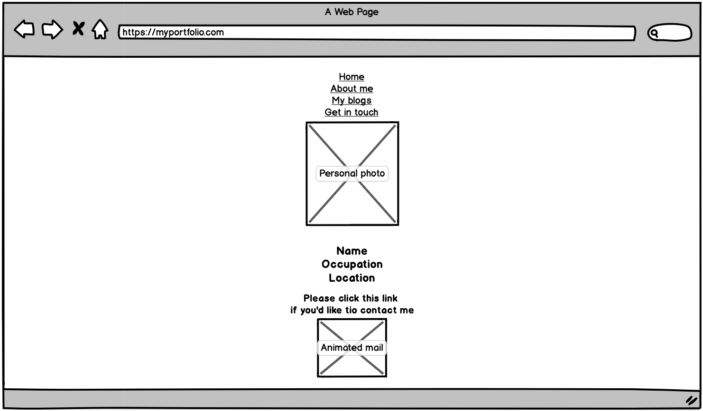
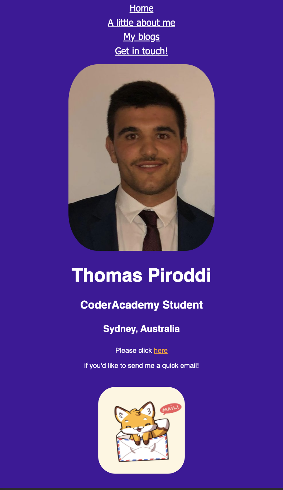
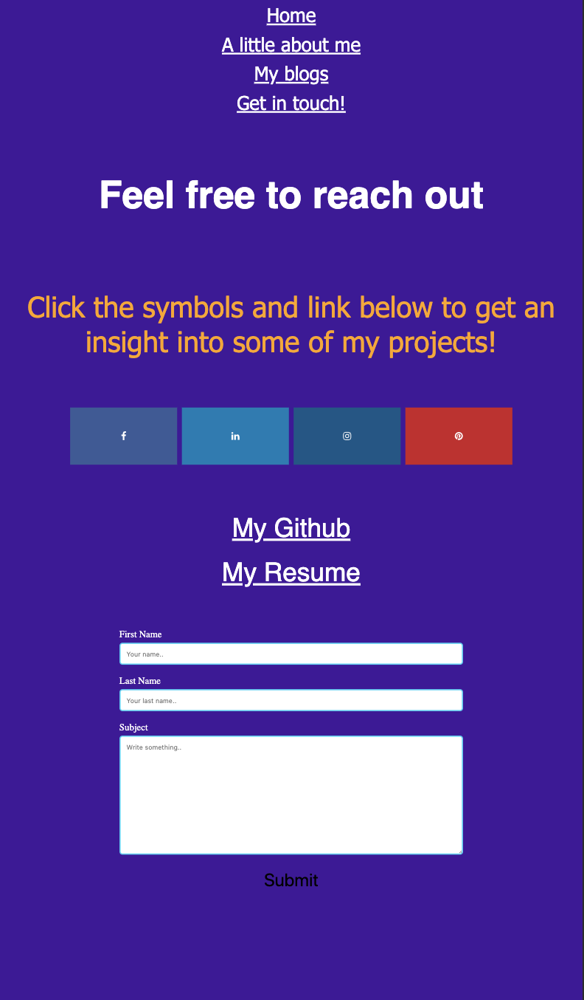

I used Trello to track my progress on the site over the last 9 days.
18/5/2020

22/5/2020
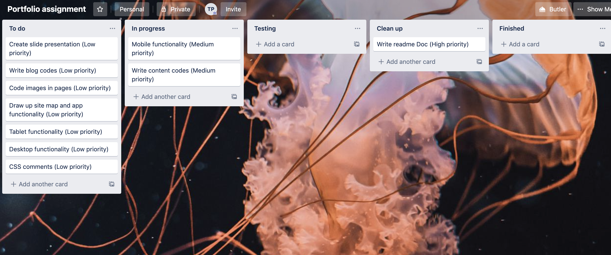
23/5/2020
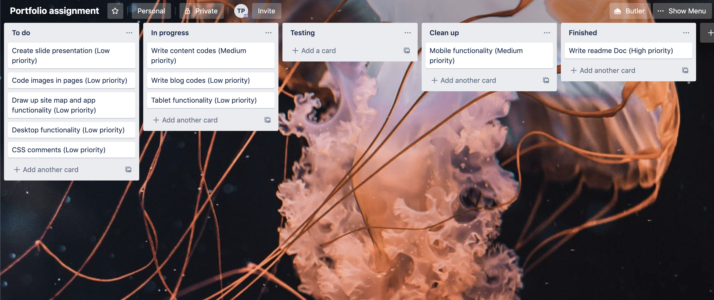
24/5/2020
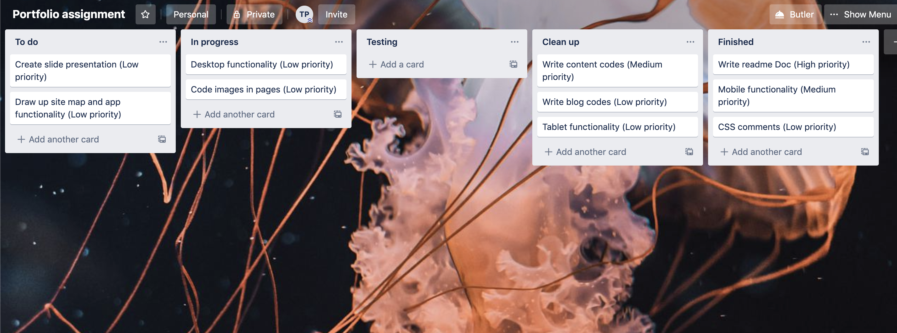
25/5/2020
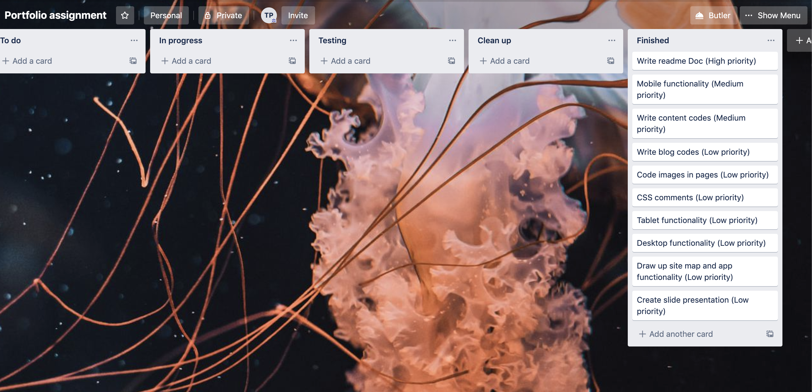

## 5) Target audience

The target audience of my site can ideally range between professional viewing or leisurely browsing of fellow coders. The mock portfolio shows my past projects including links to my GitHub, my resume, and some personal details that could help an employer evaluate my coding history and see if I would be potentially employable. The other target audience of the portfolio is for fellow coders/classmates/work friends. They can also see my previous works but more importantly see what I occupy myself with outside of code and get a little insight into my everyday life.

## 6) Tech stack

For the portfolio I’ve used HTML and CSS. For managing my project I’ve used Trello, and for design inspiration I used Balsamiq. I also used Github for hosting.